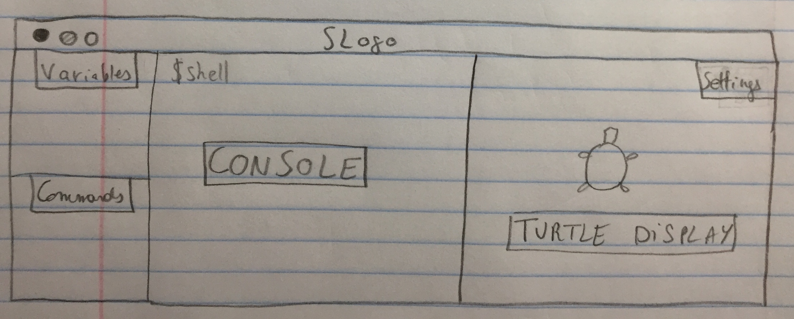
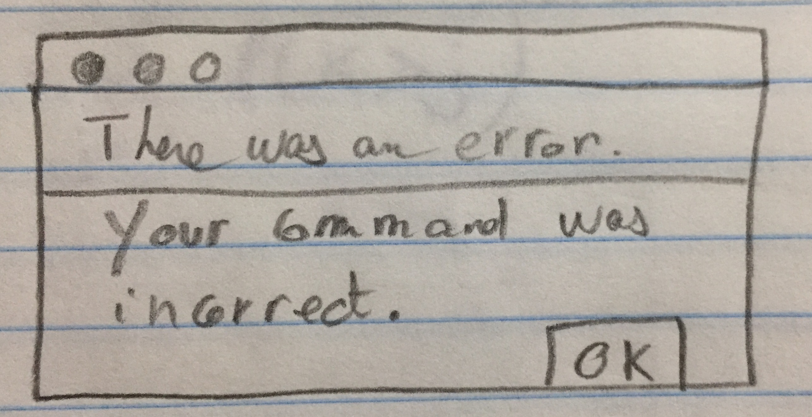

Design Specifications - Team 10
=============

Written by Elliott Bolzan (eab91), Jay Doherty (jld60), Dennis Ling (dl186), and Alex Zapata (az73).

### Introduction

Our "Simple Logo" program is intended to provide an integrated development environment that allows users to write Slogo programs. We are attempting to solve the problem of developing a flexible, extensible set of API's that work together with the GUI to create a positive IDE experience for the user. The primary design goals of our program are to separate unnecessary dependencies between the front-end and back-end and to create a minimal, yet useful and extensible API. 

In particular, we have drawn clear lines among our four necessary APIs for the internal/external back-end and front-end that allow us to control the flow of dependencies and necessary objects and data. We will utilize the use of java Interfaces, superclasses, and subclasses in order to minimize duplicated code and to allow our code to be the most flexible; our program will be extremely flexible in the cases where we may need to implement an Interface or extend a superclass. 

The primary architecture of our program will maintain mostly private classes unless the need for the exchange of data are necessary among our classes; this will allow for the open extension of commands, displayed objects on the GUI's, turtle properties, and more while closing off access to most (private) inner methods and classes that the user and other parts of the program do not need to see.

### Design Overview

The front-end and back-end of our design is divided in the following way:


The basic idea of our organization is that the front-end will detect user input, and the back-end will handle it. When the front-end detects a new input, it will pass it to the the back-end as a String to be parsed. Once the back-end has finished parsing, it will pass back a Command object. This Command object has a single public method that can be called to execute it. Under this structure, the API used by the Console and the back-end parser can be incredibly simple because it involves this simple handing back and forth of objects. The front-end provides Strings and the back-end provides ready-made Commands, and the front-end doesn't need to know or care about how these commands get made, it just knows that all commands can be executed.

The rest of the front-end external API is provided to make Commands powerful. They should be able to do interesting stuff like printing math results or moving the Turtle around screen, so methods that support this behavior must be provided by the front-end. 

The rest of the back-end external API is provided to make the UI powerful. While `parse(String input)` provides the main functionality in terms of executing commands, other kinds of input might need to be handled differently. The UI should be able to see the history of commands and the current state of variables, so methods that support this behavior must be provided by the back-end.

The front-end internal API is focused on providing features that do not require any processing by the back-end. This should include changing the color or formating of the display, changing the input language, and viewing lists of old commands or variables. 

The back-end internal API is once again focused on providing features and ways of changing the back-end processing that the front-end does not care about. Part of this extensibility is built into the Command interface, which allows an obvious way for new commands to added to the Slogo language. 

### User Interface

Our user interface for this project will look as follows:



Three major components are visible on this image:

1. **The State**: this section, on the left, contains the user's variables and the commands he has defined. The user is able to edit the variables by clicking on them, or run commands by clicking on them. Both of these displays, the variable-display and the command-display, will be implemented as table views. 
2. **The Console**: this section, in the center, accepts the user's text input. By default, the cursor is active in the console. When the user types, the output is displayed in the console. When the user presses enter, his text is parsed as a command and the results are displayed in the **TurtleDisplay**. Pressing the `UP` key on the keyboard will let the user view, and optionally run, his past commands.
3. **The TurtleDisplay**: this section, on the right, contains the turtle and its drawings. The user should be able to view the turtle's movement in this section. In the top right of this section, there is a **Settings** button: clicking this button loads a modal window, from which the user can modify the color of the pen, the turtle's image, and the background of the **TurtleDisplay**.

There are several possible errors that the program can encounter when an individual is using it. These errors will all be displayed using a JavaFX Dialog. The following errors will be handled:

- **Bad input**: this type of error occurs when the user incorrectly forms a command and seeks to run it. The program catches this error, and informs the user of it using a Dialog. 
- **Invalid operation**: this type of error occurs when the user seeks to run a problematic command, like `QUOTIENT 5 0`. Generally speaking, this type of error will be raised when the user seeks to run an expression that is mathematically prohibited. In that scenario, the user will be informed using a Dialog.
- **Out of bounds**: this type of error occurs when the user seeks to move the turtle out of bounds. If the user calls `FORWARD 3000` and the execution of the command would result in the disappearance of the turtle, the user would be notified using a Dialog.

An example of such a Dialog, for a **bad input** error, would be:



We chose to group all the customizations options under a **Settings** button in the top right of the **TurtleDisplay**. When the user clicks on this button, a modal view with all possible customization options appears. We had several reasons for designing our program this way:

- To prevent our **TurtleDisplay** from becoming cluttered, and providing our Turtle with the most possible real estate.
- To accomodate further customization options in a more flexible manner. 

### API Details

Here are the details for our four APIs:

#### Front-end External:

This API's methods are those that the back-end needs to have access to. Here are the methods made available by the front-end external API: 

```
public void print(String string);
public void clearConsole();
public void moveTo(Point point);
public void turn(double degrees);
public void setPenDown(boolean down);
public void setTurtleVisible(boolean visible);
public void clearDisplay();
public Dimension getDisplaySize();
public boolean isPointInBounds(Point point);
```

**How does this API support features from the assignment specification?**

This API supports these features:

- *Enter commands to the turtle interactively by entering text commands*: the APIs `print(String string)` helps accomplish this task. Indeed, the user's text must be printed to the screen, and the output of his commands must be displayed as well.
- *See the results of the turtle executing commands displayed visually*: the APIs `moveTo(Point point)`, `turn(double degrees)`, `setPenDown(boolean down)`, `setTurtleVisible(boolean visible)`, and `clearDisplay()` functions are used to accomplish this task.

Some features, like *clearing the console*, are included here because we think they might be useful down the road – even though they aren't part of our current assignment specifications.

Other features, like *set a background color for the turtle's display area*, are handled by the front-end's internal API. Most customization features, as well as features that are purely related to the GUI, are in the internal API, because the back-end need not know of their functioning or existence. 

**What resources does this API use?**

This API will make use of the following resources:

- The **Console**: printing to and clearing the console will necessarily require a reference to the Console object.
- The **TurtleDisplay**: moving or turning the turtle, for instance, will require a reference to the TurtleDisplay object. 
- The **Turtle**: setting whether the pen is active, or hiding the turtle, will require a reference to the Turtle object.

**How is this API intended to be used?**

This API is intended to be used from the backend.

We expect the following, general use-case:

- The front-end receives a **Command** object from the back-end.
- The front-end calls the `execute()` function on this **Command** object. 
- The `execute()` function, located in the back-end, makes use of methods from this API. For instance, if the back-end intends to move the turtle forward by 50, it calculates the new position for the turtle, and calls `moveTo(Point point)` on the front-end. 

**Note**: this last example makes it clear that this API is not intended to compute new destination points or do math of any sort. It is simply meant to be used to display the results of calculations done in the back-end.

**How can this API be extended?**

This API can be extended in the following ways:

- By **making use of** current methods. Consider the following scenario: a coder needs to implement a new feature, in which the **TurtleDisplay** is cleared and the **Turtle** is moved to the bottom left of the screen – not the center. The coder could construct this feature using the `clearDisplay()` and `moveTo(Point point)` methods in conjunction.
- By **adding** methods. While this method is not ideal because it requires an update to the entire API, it does remain a possibility.

Ideally, we would like this API's methods to be closed for modification: they were designed to fulfill a role, and they fulfill it. New features should be constructed by either combining functionality available in the current methods, or, less ideally, by creating new methods entirely in the API. 

**Why are we introducing these classes?**

In discussing this front-end external API, we mentionned several classes: the **Console**, the **TurtleDisplay** and the **Turtle**. Here, we justify the inclusion and creation of these classes.

- **Console**: intuitively, a program like SLogo that requires a user's input to a shell will need a Console class. This API needs this class to exist, in order to be able to print to the console and clear it, eventually. Additionally, it makes sense for this class to be its own abstraction: the user interface classes will get large and cluttered if they are not split into several functional modules.
- **TurtleDisplay**: likewise, a program that wants to visualize the movements of a turtle across a screen will need a class to control that space. This API contains `moveTo(Point point)` and `turn(double degrees)` methods, so it makes sense to create a standalone class in which these events can take place. 
- **Turtle**: finally, it is normal for a program that wishes to control a turtle to have au **Turtle** class. Why is the turtle not simply an image controlled from the **TurtleDisplay**? This API has methods like `setPenDown(boolean down)`; those methods control instance variables that conceptually belong to the turtle. As a consequence, it makes sense to have a **Turtle** class to contain those variables.


#### Front-end Internal:

The purpose of this API is to provide methods that the front-end will use to implement features that are exclusively handled within the front-end. These methods should provide areas for extension, and they should be able to be overrode without impacting the back-end.

```
public void showMessage(String message);
public void setBackgroundColor(Color color);
public void setTurtleImage(String path);
public void setPenColor(Color color);
public void setLanguage(String language);
public void showHelp();
public void showHistory();
public void updateVariables();
public void updateCommands();
public void runCommand(String command);
```

**How does this API support features from the assignment specification?**

The following features are listed with the commands that implement them:

* *See errors that may result from entered commands in a user friendly way* --implemented by: `showMessage(String message)` which will display a JavaFX Alert with the message.

* *Set a background color for the turtle's display area* -- implemented by: `setBackgroundColor(Color color)`

* *Set an image to use for the turtle* -- implemented by: `setTurtleImage(String path)` where `path` specifies a new image file.

* *Set a color to use for the pen* -- implemented by: `setPenColor(Color color)`

* *See commands previously run in the environment (even better, make them directly clickable to execute)* -- implemented by: `showHistory()` (which will be called by the user pressing the up arrow-key to look through a scrollable list of old commands) and `runCommand(String command)` (which will be called on clicking one of those old commands).

* *See variables currently available in the environment* -- implemented by: `updateVariables()` which will be called to refresh the permanent sidebar that shows variables and their values.

* *See user-defined commands currently available in the environment* -- implemented by: `updateCommands()` which similarly refreshes the sidebar that shows user-defined commands.

* *Choose the language in which SLogo commands are understood* -- implemented by: `setLanguage(String language)` which simply changes the properties file used to interpret commands.

* *Access an HTML formatted help page* -- implemented by: `showHelp()`

**What resources does this API use?**

Since this API is contained internally within the front-end, it should only use front-end resources. Methods that modify the Turtle Display should for example not need to know the turtle's coordinates since that is data held by the back-end. `showMessage(String message)` might need a reference to the Console if it is printing a message there, or it may be implemented purely with JavaFX Alerts. `showHistory()`, `updateVariables()`, and `updateCommands()` will need references to their particular GUI elements, and they will make use of the back-end API to refresh the displays with the most up-to-date variables and commands. `runCommand(String command)` will probably invoke `parse(String string)`, which is another back-end method made available by the back-end API.

**How is this API intended to be used?**

This API is intended to specify the methods that are internal to the front-end, so it should be used to implement front-end specific features and provide an extendible interface. 

We would expect this API to be used in the following scenarios:
* The front-end catches an exception and needs to display an error to the user
* The user wants to change the visuals of the Turtle Display (change colors or images)
* The user wants to see old commands
* The user wants to add a variable and see its value on screen
* The user wants to add a custom command
* The user wants to change languages
* The user wants to see help from a web page

**How can this API be extended?**

This API can be extended to include more UI-specific features, like more sidebars to display different kinds of information about the state of the environment. To make this very easy to extend, it may be that certain methods like `updateVariables()` and `updateCommands()` could be combined in a superclass `update()` method, with VariableDisplay and CommandDisplay objects each overriding this method to check the appropriate data structures in the back-end. This is an example of a feature that maybe isn't the best to reason about as a Java interface but rather as an inheritance hierarchy.

**Why are we introducing these classes?**

In this section we have focused on discussing the interface for the API in terms of an actual Java interface which cannot be instantiated like a class. However, we will likely not keep this as an interface in the final implementation since these methods are unlikely to all be implemented by a single object. As mentioned above, one idea would be to have a superclass Display that is extended by VariableDisplay, CommandDisplay, HistoryDisplay (even ConsoleDisplay?). This way the process of updating all of the displays could be streamlined, and the path to add new sidebars or other display elements to the UI would be very obvious.

#### Back-end External:

The purpose of this API is to supply the front-end with necessary methods that pertain to the parsing, commands, turtle, or exceptions. Here is an initial list of methods made available by the back-end external API:

```
public Command parse(String input);
public List<String> getHistory();
public String getPreviousCommand(int k);
public Point getTurtlePosition();
throw BadInput();
throw InvalidOperation();
throw TurtleOutofBounds();
public void execute();
public List<Variable> getVariables();
public void setVariable(Variable variable);
public List<Command> getUserDefinedCommands();
```

**How does this API support features from the assignment specification?**

* *Recognize these basic commands*  -- implemented by `parse(String input);` which parses the string input and returns the correct command to the front-end.

* *Throw errors that result from incorrectly entered commands* -- implemented by `BadInput();` which throws an exception when the input string is incorrectly entered. 

**What resources does this API use?**

This API will make use of the following back-end resources:

- The **Turtle** object, which maintains the position of the turtle. This allows the back-end to determine if there is a TurtleOutofBounds() exception, and to allow the position to be returned to the front end.
- The **History** data structure, which will maintain a comprehensive history of the commands that have been processed.

**How is this API intended to be used?**

This API is intended to be used by the front-end. We expect the front-end to be able to:

- Obtain the history and display commands as needed
- Know what type of exception to throw and display when an error occurs
- Update its turtle position as commands continue to be executed

**How can this API be extended?**

This API can be extended by:

- Editing current methods to be more flexible and comprehensive. For example, if the front-end needs more data on the turtle besides just the position, we can return a more comprehensive list of the Turtle data besides just the position (including a boolean for pen, a double for heading, etc.).

- Adding public methods that the front-end will be granted access to. In the case where more objects/data are necessary for front-end processing, more getters can be made available.

**Why are we introducing these classes?**

The primary purpose of these methods is to allow the front-end to function smoothly by providing the required resources. The parser is necessary and intuitive as it provides the resource to parse through the input and to return a command. The History data structure maintains the list of commands as a resource available to both the front end and back-end. The Turtle class object will have public methods that allow the front-end to access whatever data it needs for Turtle related inquiries that are kept updated in the back-end.

#### Back-end Internal:

The purpose of this API is to provide methods for the back-end that will be used to implement the functionality of our program. These methods will supply the necessary resources for our back-end logic to function smoothly; here is a list of methods that we believe we will need:

```
public Command getCommand();
public Command parse(String input);
public Variable getVariable();
public void setVariable(String key);
public void addHistory();
public Point getPosition();
public boolean hasPen();
public boolean isHidden();
public double getHeading();
public void setPosition();
public void setPen();
public void setHidden();
public void setHeading();
```

**How does this API support features from the assignment specification?**

* *Recognize these basic commands*  -- implemented by all of our necessary `getX()` and `setX()` methods that will update the required variables and maintain the data/objects as needed.

* *Throw errors that result from incorrectly entered commands* -- implemented by the parse command by recognizing when an incorrectly entered command is given as the input string.

**What resources does this API use?**

This API will make use of several classes as resources (super and sub-classes) such as the following:

- The **Command** object, which is a superclass to any potential command. Subclasses will include the LogicCommand, MathCommand, TurtleActionCommand, and TurtleLogicCommand.
- The **Turtle** object will maintain all of the necessary information about the turtle, including the position, heading, pen, and hiding data.
- The **Parser** class, which will host the history and catching of errors.
- The **Variable** class, which will hold the creation of all variables throughout the running of the program.

**How is this API intended to be used?**

This API is intended to be used as a way to supply information throughout the back-end. With these methods, we can:

- Add to our history, 
- Update our Turtle information 
- Maintain variables

Additionally, the parser will be used as a way to catch exceptions and throw them to the front-end to display.

**How can this API be extended?**

This API can be extended by:

- Extending our current hierarchy of super and sub-classes. For example, if we need to add another math command, we can extend the MathCommand class (which extends the Command class).

- Add public methods that supply information that the back-end will need. In the case where more data about the Turtle may be needed, we can simply add more methods to access this information to make it available throughout the back-end classes. 

**Why are we introducing these classes?**

The primary goal of adding all of these classes is to grant a cohesive way to manipulate data throughout the back-end. The Parser class is necessary to return the correct command and to check for errors, as listed in the design write-up. The Turtle class will be used as an efficient way to store all of the information we need that relates to each Turtle object. The Command superclass will be easily extensible with the use of layers of subclasses in order to maintain a clear heirarchy of commands. These classes will maintain the logic and functionality of much of the program.

### API Example Code

We seek to go through the following use-case: 

*The user types 'fd 50' in the command window, and sees the turtle move in the display window leaving a trail, and the command is added to the environment's history.*

Here are the steps necessary to complete that task:

- When the user presses `Enter`, the **Console** calls `parse(String string)` (in `public class Parser`) using the user's input.
- The `parse(String string)` method returns a **Command** object to the **Console**. 
- Simultaneously, the command is added to the environment's history. This is done by the `public void addHistory();` command, which appends the command to the end of the history list of commands.
- The `execute()` method (in **Command**) is called on the **Command** object from the **Console**.
- From the `execute()` method, the destination point for the turtle is computed from the current point (obtained using `Point getTurtleLocation()` (in `public class Turtle`) and the 50 pixel advance. The `moveTo(Point point)` method (in **TurtleDisplay**) is called with the new destination. The position of the Turtle is updated in the `public class Turtle` by setting the position `public void setPosition()` of the turtle to the current position plus 50. 
- The user sees the turtle move to its new point, leaving behind a trail.

More use cases follow, two for each API. 

#### Front-end External:

1\. *The user runs three commands in succession: he hides the turtle, moves it left by 50, and shows it again. How should this API be used during these commands?*

- After the back-end has parsed the first command into a **Command** object, that object's `execute()` method should call `setTurtleVisible(false)` on its reference to the front-end.
- After the back-end has parsed the second command into a **Command** object, that object's `execute()` method should call `moveTo(destinationPoint)` on its reference to the front-end, passing the point the **Turtle** should move to as a parameter.
- After the back-end has parsed the third command into a **Command** object, that object's `execute()` method should call `setTurtleVisible(true)` on its reference to the front-end.

2\. *The back-end wishes to determine whether a point is within the bounds of the **TurtleDisplay**. If the point is not in bounds, the back-end wishes to inform the user. How would the back-end use this API to achieve this task?*

The back-end should follow this sequence of steps:

- The back-end should call the `boolean isPointInBounds(Point point)` method with the point in question.
- Based on the result, the back-end can either continue, or raise an `OutOfBounds` exception.
- In the event an exception is raised, the **Console** will catch it, and the front-end will display a Dialog informing the user of the error.

#### Front-end Internal:
1\. *The user wants to re-run an old command. How would the front-end use this API to achieve this task?*

- When the user presses the up arrow key to prompt the display, `showHistory()` should be called and a pop-up scrollable list of commands should appear. The user should be able to navigate this list with the arrow keys.
- When the user finds the command they wish to execute and click on it or highlight it and press enter, the `runCommand(String command)` method should be invoked.
- At this point, the program will invoke `parse(String string)` on the command, and execution of the command will be handled as described in the other APIs. The job of the internal front-end API is just to provide the command selection list.

2\. *The user tries to set a new image for the turtle, but the file is corrupted and does not load properly. The UI should display an error and abort changing the turtle image. How would the front-end use this API to achieve this task?*

- To change the turtle image, `setTurtleImage(String path)` is invoked by passing it the the file path as a String.
- When the front-end tries to open the image and gets an IOException, it will invoke `showMessage(String message)` to display an alert and inform the user that there is an issue with their file.
- Depending on the implementation, it may be necessary to re-invoke `setTurtleImage(String path)` on the previous path to properly reset the image, but in all likelihood this will not be necessary and will just be handled by the interrupt caused by the Exception.

#### Back-end External:
1\. *The user wants to obtain the previous command, but incorrectly enters a badly formatted command instead.*

- The command will be sent to the `public Command parse(String input)` method, which will attempt to parse the String.
- Upon realizing the String is incorrectly formatted, the `parse` method will throw a `badInput();` error to the front-end.
- The front-end will receive the exception and will display the correct exception on the GUI.

2\. *The user wants to obtain the previous command, and correctly inputs the String command!*

- The command to obtain the history will be sent to the parser `parse(String input)`, which will correctly return the previous history Command. 
- The front-end will receive this command, and will run `execute()` on this particular command.
- In the `execute()` method, the back-end will supply the front-end with the correct previous command with `getPreviousCommand(int k)` depending on the integer that the user specified. 
- The `print()` method in the front-end is called in order to notify the user what the previous command was.

#### Back-end Internal:
1\. *The user moves the Turtle forward 5, and then forward another 6, but the grid is only 10 lengths long.*

- The first forward command is sent to the parser `parse(String input)` method, which parses the command and sends it to the front-end.
- The front-end calls `execute()` on *forward 5* in the back-end.
- The command will call `setPosition()` to update the Turtle position to be 5 more of its initial position.
- Control is returned to the front end to update the position on the GUI.
- The second forward command is parsed and execute is called again.
- Upon execution, the logic will check if `setPosition()` will make the position of the Turtle be larger than the Grid. 
- In this case, it will, so an exception will be thrown to the front end to display.

2\. *The user wants to use the TOWARD command, but chooses an inappropriate point that exceeds the bounds of the screen.*

- The first command that is called is `parse(String input)` as called on the user-input. This parses the string and sends the subsequent command to the front-end.
- The front-end calls `execute()` on the command *TOWARD x y* in the back end.
- `TOWARD x y` begins to execute with the position (x, y).
- Through an exception-handling test, the TOWARD method determines that the point (x, y) is out of bounds and throws an out of bounds exception to the front-end to display the error.

3\. *The user inputs a lower-case string into the console.*

- The string gets passed to the parser, who uses `parse(String input)` on the string.
- In the process of parsing, the parser will use a `toLowerCase()` method on some component of the input and proceeds to define the command from the string.
- The program proceeds sending the command back and error-handling.

### Design Considerations

* The main design considerations at this stage of developing the interactions between the front and back-end APIs resides in deciding how the two interact and communicate to parse information and manipulate the visual/informational components of the
program. In regards to communication between the front-end and back-end, the team immediately bonded to the idea of the user
inputting a string into the console, that will be sent to the back-end and understood by means of a parser for all possible commands. Then, once the command (in which each object will become its own class) has been parsed, it will be sent back to the 
front-end to be executed. 
* It was clear from the beginning that the input of the user would have to be parsed and made into some kind of executable object, but other design considerations arose in the aspect of how that object would be passed from the front-end to the back-end and what that meant for the command object. One other consideration was to have only an explicit flow of information from the front-end to the back-end. Although pretty enticing because of the limitation of dependencies, this was decided against because it made direct manipulations to the display an unnatural event. In other words, commands like CLEARSCREEN would have to use a completely different mechanism, because after parsing there would be no communication to the front-end to tell it to for example clear the group.
* The other main consideration was for the front-end to call the back-end to parse, then have the front-end execute the method to change states in itself, versus getting the back-end to do so. The problem with this method is that the internal states of objects like the turtle should remain hidden, and the methods that manipulate the turtle's data protected by varying levels of privacy.
* What needs to be discussed about the design is how the rather generic execute() methods within our command classes will be able to access the objects within the front-end whose properties need to be changed. One possibility, although not particularly pleasing is to instantiate a Method superclass that hold the current command that will already have been instantiated with the necessary instance variables of the turtle to get its location and other states. 
* Overall, the method of Command management aforementioned offers a low amount of dependencies while still allowing for a wide variety of types of commands to take place, in regard to the screen that the user sees and the private variables of the object on the screen. Once the execute command has been decided upon, the communication between the front-end and back-end will effectively be protected as a series of calls to objects versus the unnecessary passing around of objects not involved with the needed command. 

### Team Responsibilities

Our team is split-up into two groups: the **front-end** group (Elliott Bolzan and Jay Doherty) and the **back-end** group (Dennis Ling and Alexander Zapata). 

All members of the group are responsible for documenting and refactoring their subgroup's code, in addition to their own.

#### Within the front-end group:

- Elliott will take primary responsibility for the **Console** and its components, as well as the **State** display (variables and user-defined commands). He will take secondary responsibility for the **TurtleDisplay** and its components.
- Jay will take primary responsibility for the **TurtleDisplay**, the **Turtle**, and their components. He will take secondary responsibility for the **Console**.

Both Elliott and Jay will tie in the different front-end elements as part of their primary responsibility.

#### Within the back-end group:
- Dennis will primarily be responsible for the **Command** superclass and it's subclasses such as **MathCommand** and **TurtleActionCommand.** Additionally, Dennis will be in charge of maintaining the information with regards to the **Turtle** class such as the heading, 
- Alex will primarily be responsible for the **Parser** class and the error throwing and recognition within parser. Additionally, Alex will also help with the **Turtle** class in maintaining its functionality.
- Both Alex and Dennis will work together to fill-in any holes throughout the back-end logic and classes that may need to be added throughout the project and its extensions. 