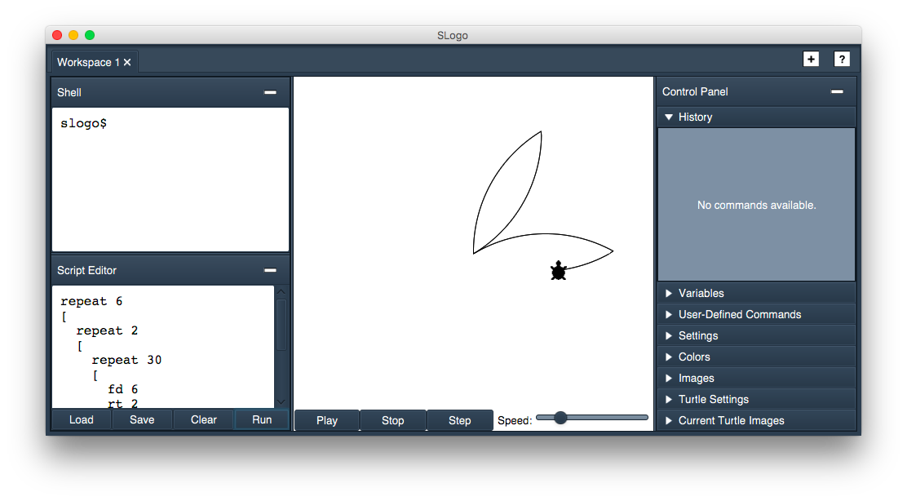
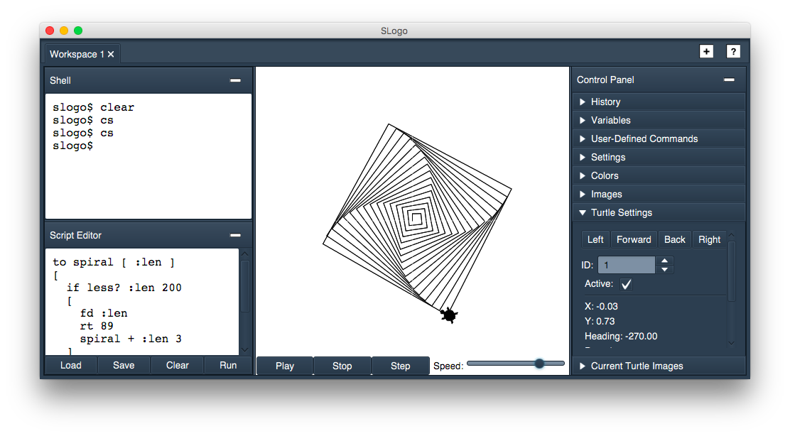

SLogo
=====
A team project (5-person group) for Duke's Computer Science 308 (Design and Implementation). For this third project, we built a turtle-based IDE for the Logo language (approximately 6300 lines of code). 

This program is capable of executing SLogo code in a variety of languages; of animating turtle movements; of running existing SLogo scripts; and of keeping track of a variety of workspaces.

### Program Files
* `Main.java`: contains main() and is used to start the program.
* `resources/images`: contains turtle images.
* `resources/languages`: contains language files specifying all of the Slogo commands.
* `resources/style.css`: contains the CSS code used to style our program.
* `resources/UserInterface.properties`: contains resources for user-facing text, including error messages.
* `resources/WorkspaceSettings.properties`: defines a workspace's initial configuration settings.
* `data/examples`: contains scripts that can be used to test the program.