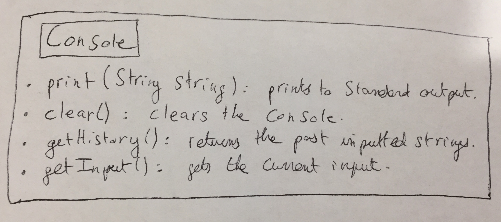
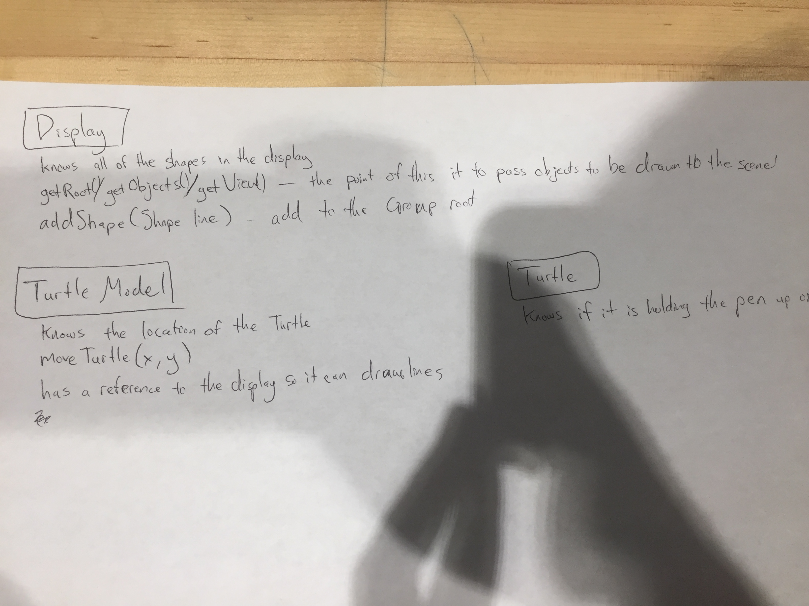
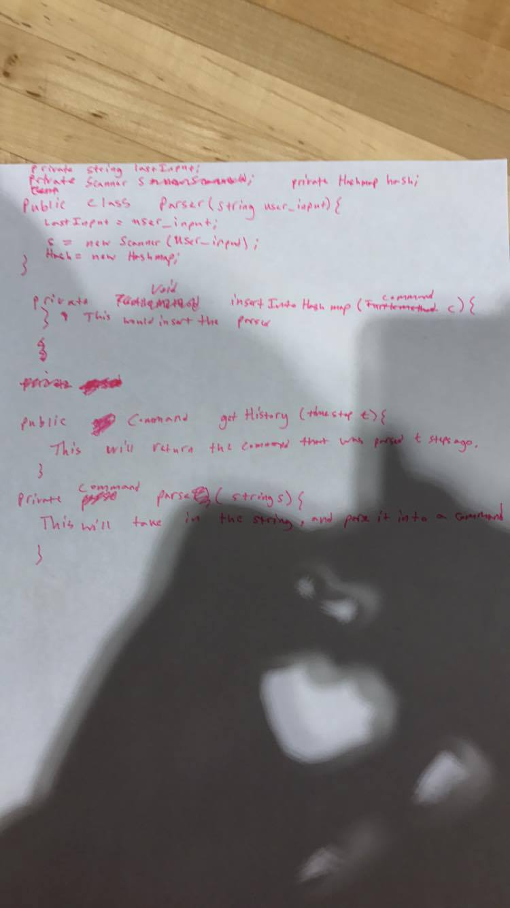

# API Exercise – SLogo

## Elliott Bolzan (eab91), Jay Doherty (jld60), Dennis Ling (dl186), Alex Zapata (az73)

### SLogo Architecture Design

**When does parsing need to take place and what does it need to start properly?**

Parsing needs to take place after the user has provided an input string. This string is passed to the backend for parsing. For the parsing to begin properly, it simply needs to be passed a string from the frontend. 

**What is the result of parsing and who receives it?**

After the user-input is parsed in the back-end, it results in a method call that could be received by the front end and/or the back end. This could potentially change the state of variables and the display.

**When are errors detected and how are they reported?**

Bad input errors are detected in the back-end during parsing and are reported to the front end as exceptions. Logic errors such as making the turtle move out of bounds are caught in each individual method which could be in either the front-end or the back-end.

**What do commands know, when do they know it, and how do they get it?**

Commands know know what type of command they are, and depending on the command they may have different parameters associated with them. They may also know the values of variables stored in the program as needed. They know these things after the input has been parsed and the command has been made. They get the values of their parameters via input and parsing.

**How is the GUI updated after a command has completed execution?**

As a command is finishing its execution, it will signal a front-end method to update the GUI as needed. The back-end will pass data to the front-end, including, but not limited to: the position of the turtle, whether its pen is active, the path it must follow.

### CRC Cards

Here are our CRC cards:

